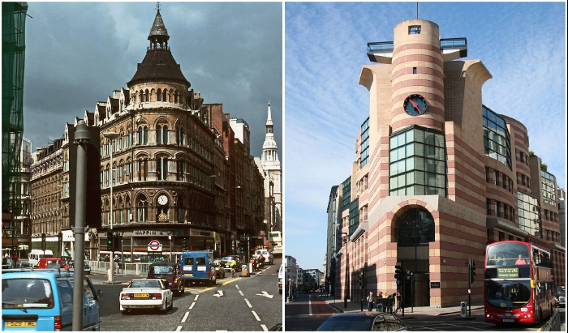
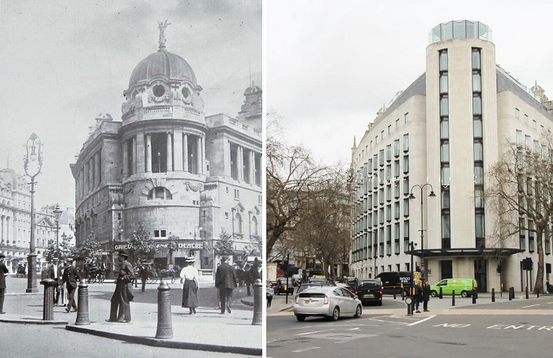
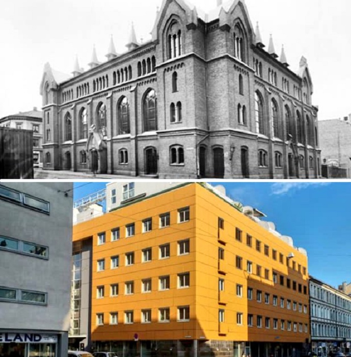
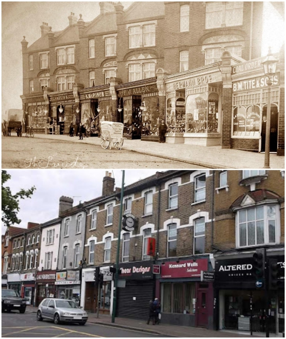
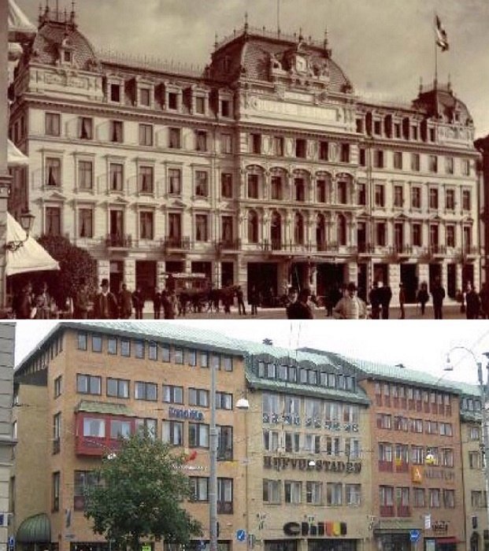

# Beauty versus ugliness: 10 renovations that have changed the face of buildings beyond recognition

In this world, nothing is immune to the flow of time, even the most grandiose buildings dim and deteriorate over time. To stop this process, architects and builders are undertaking the restoration of historic monuments. It would be OK, but it happens that good intentions end in a real failure. The following are 10 striking examples of how unskilled intervention has turned the exquisite beauty of architectural masterpieces into a real laughingstock.

- The Gaiety Theatre (London, UK)

"The Gaiety Theatre on Aldwych, in central London, was built in 1864 on the site of the Lyceum Theatre. Very quickly it gained popularity thanks to the musical hall, burlesque, pantomime and operetta that were fashionable at the time. From the 1890s the theater introduced a new style of musical theater known as Edwardian musical comedy. The twentieth century was fateful for the theater building. First it was completely rebuilt (1903), and during World War II it was destroyed altogether. After the reconstruction the theater was empty for many years, until in 2020 there was a completely new building, which does not correspond to its former appearance.

- The monstrous transformation of an old building (Oslo, Norway)

In the old part of Norway's capital you can still enjoy beautiful architectural structures, which create a special flavor that pleases both locals and visitors. Experienced tourists note the fact that the old buildings are very carefully looked after, maintained and periodically restored. But it is worth noting that in the 1970s, a lot of monuments of architecture suffered from massive transformation. At that time, the historical part of the city was taken by the modernists. Here is one example of what happened.

- "Parade of stores" on Hale End Road (London, UK)

An interesting photo taken back in 1900 shows how restoration has been detrimental to historic buildings. It is understandable that modern architects wanted to improve space and appearance of city streets, but this transformation completely deprived once glamorous stores on Hale End Road in Highams Park, London, of their attractiveness, turning them into bazaar row.

- An old hotel in Gothenburg, Sweden, turned into an ugly office center

For many of us, ancient European cities are associated with something special, where centuries-old traditions of urban planning are preserved. But how is sad to realize, even Sweden has more than a cavalier attitude toward historic buildings. Take for example the old hotel in Gothenburg, built back in 1883. When at the end of the last century the building was completely dilapidated, the city authorities have found nothing better than to allow turning it into an office center. After the commissioning of such an ugly structure, many regretted that time could not be turned back to preserve the magnificent building in its original form.

